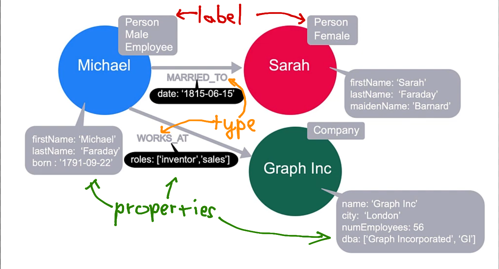

### Jak na databázi
* cloud databáze založit účet na [Neo4j](https://neo4j.com/).
    * veškeré ovládání je přes web Neo4j.
* pro lokální databázi stáhnout [Community server, Neo4j Desktop a Cypher shell](https://neo4j.com/download-center/#community).
    * Community server spustí přes terminál Neo4j server. Tento server poskytuje webové rozhraní na http://localhost:7474/. Nebo po instalaci Cypher shellu se dá připojit i přes něj.
    * Neo4j desktop je "IDE", které spouští svůj vlastní server, nebo je možné připojit i remote server - cloud nebo community server
    * Součástí archivu community serveru je i Cypher shell a admin-tool

### Užitečné odkazy
* [Documentace](https://neo4j.com/docs/)
* [Getting started](https://neo4j.com/developer/get-started/)
* [Bonus odkazy](https://neo4j.com/developer/resources/#docs-manuals)
* [Cypher cheat sheet 1](https://neo4j.com/docs/cypher-refcard/current/)
* [Cypher cheat sheet 2](https://neo4j.com/docs/cypher-cheat-sheet/current/)
* [How to Neo4j in Python](https://neo4j.com/docs/python-manual/current/)

### Nodes
* label 
    * indicates to what subset it belongs to
    * can have multiple or none
    * should have more than 4
* properties
    * key value pair
    * can be list
    * if property has no value, than it is null

### Relations
* direction
    * required, but can be queried in any direction or ignored
* type
    * required
* properties (cost, distance)
    * key value pair
    * can be list
    * if property has no value, than it is null



## Cypher
* funguje na pattern matching
* výsledek vrací v poli, kde každý element obsahuje json.
* `()` pro nody
* `(:Person)` - specifikovaný label nody
* `(:Person{ name: 'Tom Hanks'} )` - specifikovaný label nody
* `[ ]` pro vztahy
* `[:ACTED_IN]` - specifikovaný typ vztahu
* `(:Person)--(:Movie)`
* `(:Person)-→(:Movie)`

### Příklady Cypher query - vyhledávání
```sql
MATCH (p:Person) 
RETURN p

MATCH (p:Person {name: 'Tom Hanks'})
RETURN p

MATCH (p:Person {name: 'Tom Hanks'})
RETURN  p.born

MATCH (p:Person)
WHERE p.name = 'Tom Hanks'
RETURN p.name

MATCH (p:Person)
WHERE p.name = 'Tom Hanks' OR p.name = 'Rita Wilson'
RETURN p.name, p.born

MATCH (p:Person {name: 'Tom Hanks'})-[:ACTED_IN]->(m)
RETURN m.title

MATCH (p:Person {name: 'Tom Hanks'})-[:ACTED_IN]->(m:Movie)
RETURN m.title

MATCH (p)-[:ACTED_IN]->(m)
WHERE p:Person AND m:Movie AND m.title='The Matrix'
RETURN p.name

MATCH (p:Person)-[:ACTED_IN]->(m:Movie)
WHERE 2000 <= m.released <= 2003
RETURN p.name, m.title, m.released

MATCH (p:Person)-[:ACTED_IN]->(m:Movie)
WHERE p.name='Jack Nicholson' AND m.tagline IS NOT NULL
RETURN m.title, m.tagline

MATCH (p:Person)-[:ACTED_IN]->()
WHERE p.name STARTS WITH 'Michael'
RETURN p.name

MATCH (p:Person)-[:ACTED_IN]->()
WHERE toLower(p.name) STARTS WITH 'michael'
RETURN p.name

MATCH (p:Person)-[:WROTE]->(m:Movie)
WHERE NOT exists( (p)-[:DIRECTED]->(m) )
RETURN p.name, m.title

MATCH (p:Person)
WHERE p.born IN [1965, 1970, 1975]
RETURN p.name, p.born

MATCH (p:Person)-[r:ACTED_IN]->(m:Movie)
WHERE  'Neo' IN r.roles AND m.title='The Matrix'
RETURN p.name, r.roles

MATCH (p:Person)
RETURN p.name, keys(p)

CALL db.propertyKeys()
```

### Příklady Cypher query - vytváření/úprava/mazání
* `MERGE` nevytvoří nový node, pokud už stejný existuje
* `CREATE` vytvoří nový node, i když stejný existuje
* při vytváření nodu se musí zadat property nebo label
* pokud se při vytváření zadá property, tak se ttohle property bude používat jako primární klíč. Jinak primární klíč bude vnitřní id.
* při vytváření vztahu je třeba specifikovat směr. Pokud směr není specifikovaný, tak je mu přidělen směr z leva do prava tak, jak byly napsány v query.
* `SET` přidává nebo updatuje property
* `REMOVE` = `SET` property na null
```sql
MERGE (p:Person {name: 'Michael Cain'})

MERGE (p:Person {name: 'Katie Holmes'})
MERGE (m:Movie {title: 'The Dark Knight'})
RETURN p, m

MATCH (p:Person {name: 'Michael Cain'})
MATCH (m:Movie {title: 'The Dark Knight'})
MERGE (p)-[:ACTED_IN]->(m)

MERGE (p:Person {name: 'Chadwick Boseman'})
MERGE (m:Movie {title: 'Black Panther'})
MERGE (p)-[:ACTED_IN]-(m)

-- nelze použít, pokud jedna z node už existuje
MERGE (p:Person {name: 'Emily Blunt'})-[:ACTED_IN]->(m:Movie {title: 'A Quiet Place'})
RETURN p, m

-- raději používat tuto variantu
MERGE (p:Person {name: 'Michael Cain'})
MERGE (m:Movie {title: 'Batman Begins'})
MERGE (p)-[:ACTED_IN {roles: ['Alfred Penny']}]->(m)
RETURN p,m

MATCH (p:Person)-[r:ACTED_IN]->(m:Movie)
WHERE p.name = 'Michael Cain' AND m.title = 'The Dark Knight'
SET r.roles = ['Alfred Penny']
RETURN p, r, m

MATCH (p:Person)-[r:ACTED_IN]->(m:Movie)
WHERE p.name = 'Michael Cain' AND m.title = 'The Dark Knight'
SET r.roles = ['Alfred Penny'], r.year = 2008
RETURN p, r, m

MATCH (p:Person)-[r:ACTED_IN]->(m:Movie)
WHERE p.name = 'Michael Cain' AND m.title = 'The Dark Knight'
SET r.roles = ['Mr. Alfred Penny']
RETURN p, r, m

MATCH (p:Person)-[r:ACTED_IN]->(m:Movie)
WHERE p.name = 'Michael Cain' AND m.title = 'The Dark Knight'
REMOVE r.roles
RETURN p, r, m

MATCH (p:Person)
WHERE p.name = 'Gene Hackman'
SET p.born = null
RETURN p

MERGE (p:Person {name: 'McKenna Grace'})
ON CREATE SET p.createdAt = datetime()
ON MATCH SET p.updatedAt = datetime()
SET p.born = 2006
RETURN p

MATCH (p:Person)
WHERE p.name = 'Jane Doe'
DELETE p

MATCH (p:Person {name: 'Jane Doe'})-[r:ACTED_IN]->(m:Movie {title: 'The Matrix'})
DELETE r
RETURN p, m

-- noda nejde smazat, pokud má vazby. Tohle smaže i všechny vazby nody.
MATCH (p:Person {name: 'Jane Doe'})
DETACH DELETE p

MATCH (p:Person {name: 'Jane Doe'})
SET p:Developer
RETURN p

MATCH (p:Person {name: 'Jane Doe'})
REMOVE p:Developer
RETURN p

-- smaže všechno z databaze
MATCH (n)
DETACH DELETE n

CALL db.labels()
```